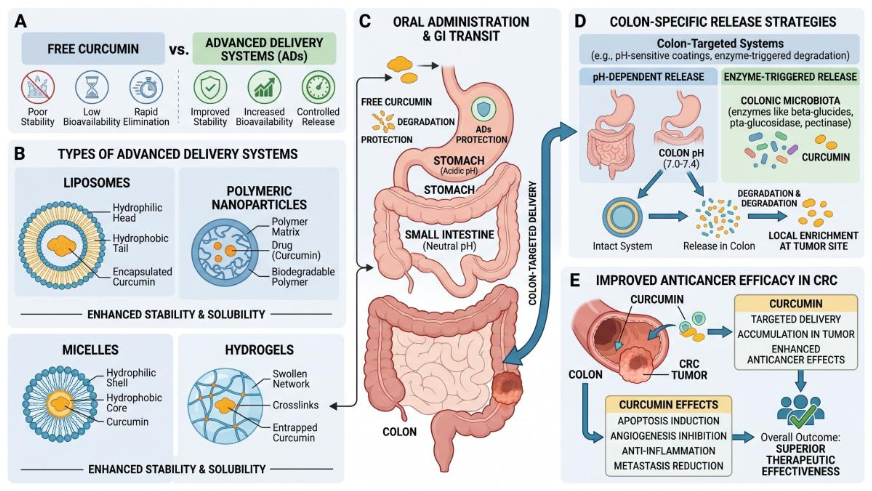

# Curcumin Indirect Pharmacology in Colorectal Cancer

A systems pharmacology and indirect pharmacology review framework for curcumin in colorectal cancer (CRC), emphasizing gut-centered mediator networks, microbiota-associated regulation, local intestinal exposure, translational delivery strategies, and computationally assisted evidence integration.

---

## Overview

This repository contains the manuscript source files, figures, supplementary materials, and computational workflows associated with the review article:

> **Curcumin as an Indirect Pharmacological Modulator in Colorectal Cancer: Gut-Centered Systems Pharmacology, Translational Challenges, and Clinical Perspectives**

The review reframes curcumin from a conventional multitarget natural product into a **gut-centered indirect pharmacology intervention**, focusing on:

* local intestinal exposure;
* microbiota-associated mediator networks;
* immune and inflammatory remodeling;
* tumor microenvironment modulation;
* delivery-system-defined intervention contexts;
* translational systems pharmacology.

---

## Graphical Framework

The repository includes publication-quality systems biology figures generated for the review.

### Gut-Centered Systems Pharmacology Framework

<p align="center">
  
</p>

**Figure:** Curcumin-mediated indirect pharmacology in colorectal cancer, emphasizing local intestinal exposure, microbiota remodeling, mediator-driven signaling, immune regulation, inflammatory modulation, and tumor microenvironment remodeling.

---

## Scientific Focus

### 1. Direct Pharmacology

The review summarizes direct curcumin-associated mechanisms in CRC:

* apoptosis;
* autophagy;
* ferroptosis;
* ROS/mitochondrial stress;
* signaling inhibition;
* epigenetic and ncRNA regulation.

### 2. Indirect Pharmacology

The manuscript further emphasizes indirect pharmacology mechanisms:

* gut microbiota remodeling;
* microbiota-derived mediator signaling;
* inflammatory modulation;
* intestinal barrier context;
* local intestinal exposure;
* immune-associated microenvironment remodeling.

### 3. Translational Systems Medicine

The repository also contains:

* delivery-system frameworks;
* PK/PD-aligned translational concepts;
* systems pharmacology schematics;
* evidence-mapping visualizations;
* AI/network pharmacology workflows.

---

## Evidence Sources

All scientific statements, mechanism summaries, and figure concepts are derived from:

* manuscript-reviewed literature;
* PubMed abstracts (`pubmed.txt`);
* manually curated Excel evidence tables;
* referenced studies recorded in `.bib`.

No unsupported mechanistic claims or fabricated datasets are included.

---

## Figure Generation

Figures in this repository were generated using:

* Python-based scientific visualization;
* AI-assisted scientific illustration workflows;
* publication-oriented systems biology layouts.

The visual design prioritizes:

* indirect pharmacology;
* systems medicine;
* gut-centered mediator logic;
* translational clarity;
* publication-quality readability.

---

## Manuscript Features

* Evidence-graded clinical discussion;
* Gut-centered indirect pharmacology framing;
* Systems pharmacology integration;
* Translational delivery framework;
* Microbiota and immune mediator context;
* AI/network pharmacology as hypothesis-generating tools.

---

## Citation

If you use this repository, please cite the associated review article.

```bibtex
@article{curcumin_indirect_pharmacology_crc,
  title={Curcumin as an Indirect Pharmacological Modulator in Colorectal Cancer},
  author={...},
  journal={...},
  year={2026}
}
```

---

## License

This repository is intended for academic and research purposes.

Please ensure proper citation of all associated literature and visual materials.
